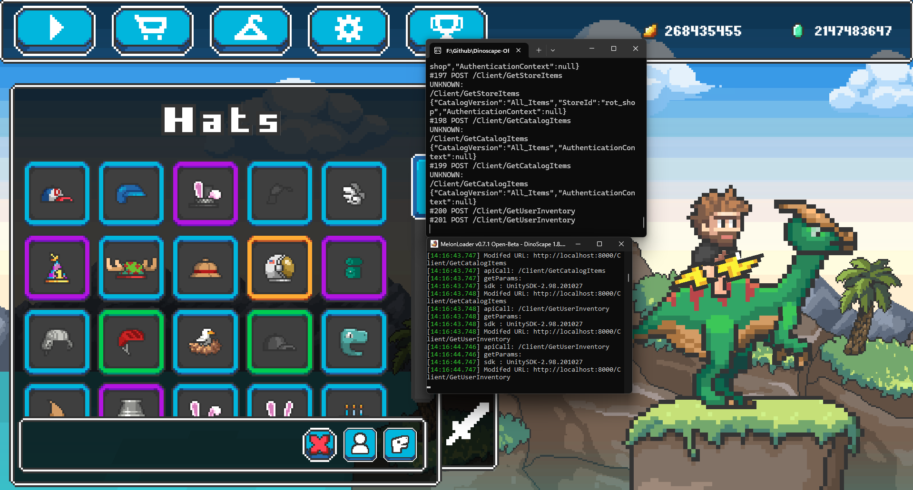

# DinoScapeOffline
Offline server for Dinoscape (WIP). Right now its mostly a POC 

# Demonstration

# Build-Requirements

- Visual Studio >= 2022
- .NET >= 9 (for the Server)
- .NET Framework >= 4.8 (for the Mod itself)

# Requirements

- The Game
- A tool to rip assets from the game 

# How to

- Go into your asset ripper of choice for unity, must be unity version 2020.3.30f1 compatible
- Extract the whole game, this will make navigating the game files a lot easier
- Now locate the following folder: Assets->Resources->customs
- Copy and paste this folder next to the server executable, or alternatively where you specified the customs path inside "serverConf.ini"
- Launch the server and the game with the mod installed and you should be good to go (server needs to be active if you want to play the game)
- Login with any credentials 

# What this is not

- Fully functional recreation of the services, it is just barebones to get the game playable alone, with everything unlocked
- A way to play multiplayer 
- Cross platform, windows only for now

# Future

- If enough interest is there, it's definitely possible to expand it and restore some more functionality of the game
